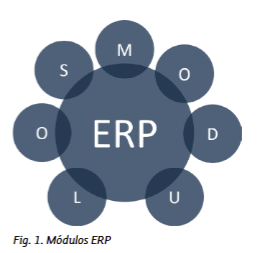

# Tema 3: Los Módulos de un ERP

---

## 1. Introducción
Un **ERP (Enterprise Resource Planning)** está compuesto por **módulos** que cubren distintas áreas de la empresa.  
Cada módulo está especializado en un área concreta (finanzas, recursos humanos, logística, ventas, etc.) y todos se encuentran **integrados** entre sí.  

En este tema estudiaremos los módulos más importantes de dos ERPs representativos:  
- ~~SAP: ERP propietario~~  
- **Odoo**: ERP libre y de código abierto.  

---

## 4. Los módulos de un ERP libre: Odoo

### 4.1. Aplicaciones financieras
- **Contabilidad**: control de facturas y pagos.  
- **Facturación**: gestión de contratos y facturas.  
- **Gastos**: monitorización y refacturación de gastos.

### 4.2. Aplicaciones de operaciones
- **Compra**: automatización de compras, estadísticas.  
- **Inventario**: trazabilidad total del stock.  
- **Proyecto**: gestión de proyectos (incluye metodología Agile).  
- **Otros**: hojas de horas, asistencia, documentos, servicio de campo.

### 4.3. Aplicaciones de ventas
- **CRM**: gestión de clientes y potenciales clientes.  
- **Punto de venta (POS)**: para tiendas y restaurantes (pagos, tickets, TPV).  
- **Ventas**: presupuestos, estrategias de precios, automatización de reglas.  
- **Otros**: Suscripciones, Alquiler.

### 4.4. Aplicaciones de fabricación
- **MRP**: planificación de pedidos de fabricación.  
- **PLM**: ciclo de vida del producto.  
- **Mantenimiento MRP**: mantenimiento preventivo y correctivo.  
- **Calidad**: planes de control y alertas.

### 4.5. Aplicaciones de recursos humanos
- **Contratación**: ofertas y procesos de selección.  
- **Empleados**: control de gastos, vacaciones, bajas, asistencias.  
- **Recomendaciones**: programas de referencias con recompensas.  
- **Aprobaciones**: solicitudes internas (viajes, dietas).  
- **Otros**: flota, ausencias, valoraciones.

### 4.6. Aplicaciones de sitios web
- **Creador de sitios web**: páginas sin necesidad de programar.  
- **E-commerce**: venta online con pagos y envíos.  
- **Chat en directo**: atención al cliente en tiempo real.  
- **Citas**: gestión de reservas.  
- **Otros**: blogs, foros, e-learning, eventos.

### 4.7. Aplicaciones de comunicación
- **Chat interno (Hablar)**: comunicación interna.  
- **Otros**: firma electrónica, encuestas.

### 4.8. Aplicaciones de marketing
- **Automatización**: campañas automáticas.  
- **Email marketing**: segmentación de clientes y campañas.  
- **SMS marketing**.  
- **Social**: gestión centralizada de redes sociales y notificaciones push.

### 4.9. Aplicación de customización
- **Estudio de Odoo**: permite crear aplicaciones personalizadas.

---

## 6. Resumen
- Los **módulos ERP** son piezas que integran todas las áreas de la empresa.  
- En **Odoo** encontramos módulos más variados: financieros, operaciones, ventas, fabricación, RRHH, webs, marketing, etc.  

---

## 7. Webgrafía
- [SAP](https://www.sap.com/index.html)  
- [Odoo](https://www.odoo.com/es_ES/)  

